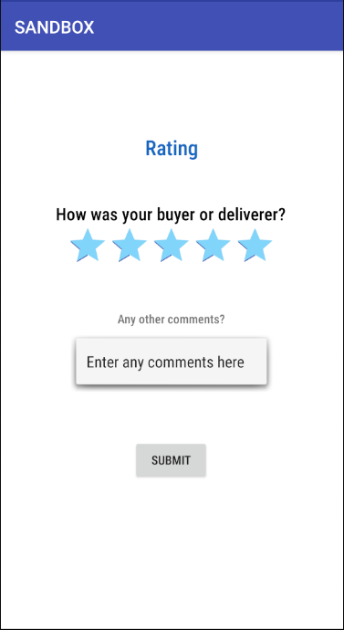

# SandBox - Healthy eatery delivery app

CZ2006 Software Engineering, AY20/21 Sem 2

## Description

SandBox is created for users who want to deliver food to other users from specific eateries with the Healthier Food Choice at a small cost, as well as for users who wish to buy food from other users from these eateries. 
This beta version of the application is currently developed for a smaller target audience of NTU undergraduates.


## Android Studio Dependencies

Android Lollipop (API Level 21)

## API

* Google Maps API 
* Firebase Cloud Firestore + Real-time database
* Firebase Authentication


## Testing

Run JUnit test on delivery creation at ```/androidTest/java/com.sandbox.chat/core/createDelivery/CreateDeliveryPresenterTest.java ```

## Screenshots
<p>


</p>
<h4> Create Delivery </h4>
<p>


</p>
<h4> Buyer place order </h4>
<p>


</p>
<p>


</p>
